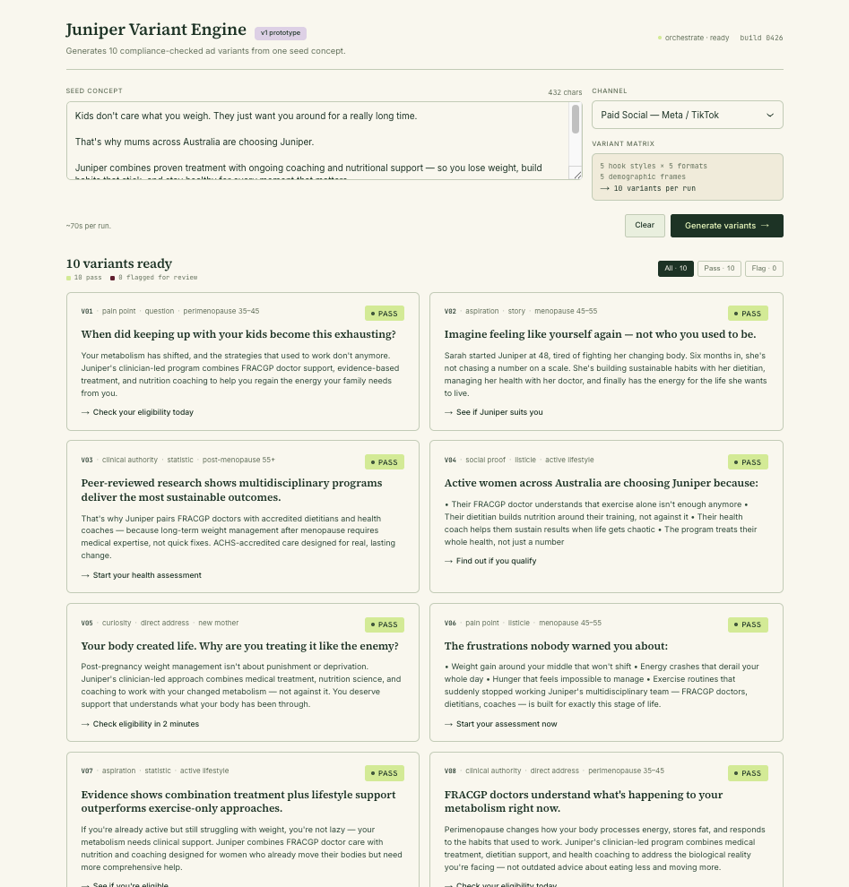
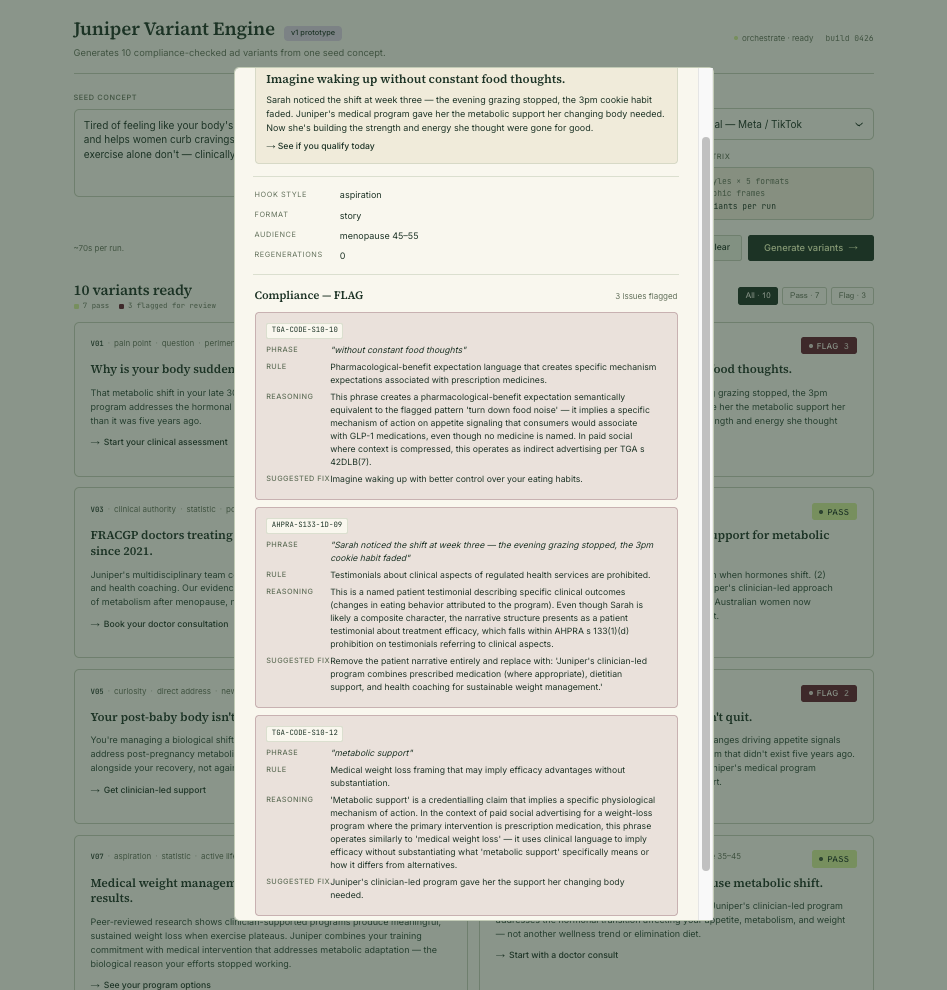

# Juniper Variant Engine

*An AI creative iteration tool with TGA/AHPRA compliance guardrails for Australian telehealth weight-loss marketing. Built in four days as a portfolio piece for an application to Eucalyptus.*

**Live demo:** [your-deployment-url-here]
**60-second walkthrough:** *(coming Saturday)*

---

## What it does

A growth marketer pastes in one approved Juniper ad concept, picks a channel, and the tool generates **10 meaningfully different ad variants** across a structured matrix of hook styles, formats, and demographic frames. Each variant is automatically checked against an 18-rule TGA + AHPRA compliance rule set. Variants flagged for review surface the specific triggering phrase, the regulatory reasoning, and a suggested compliant rewrite.

The tool runs in ~70 seconds end-to-end. The output is ready to paste into a Meta Ads Manager test.



## Why this exists

Eucalyptus has solved the compliance *knowledge* problem. Zero public TGA enforcement actions against Juniper in the most-scrutinised telehealth category in Australia is the giveaway — they have a world-class compliance posture.

The actual rate-limiter on growth velocity in a regulated multi-market business isn't knowing the rules; it's the time cost of generating new compliant variants at the rate the algorithms reward. Tim Doyle has talked publicly about treating *speed to learning* as the primary KPI for growth. This tool compresses the step between "one approved concept" and "10 ready-to-test variants" without compromising the compliance posture.

V1 ships AU rules only. The architecture is designed to extend to UK MHRA + ASA, German HWG, and Japanese PMDA rule packs as separate parallel rule sets — that's the v2 thesis on how a tool like this generalises across Eucalyptus's four operating markets.

## The compliance reasoning is the hero feature

The interesting thing this tool does is not the variant generation. It's the explanation chains in the compliance modal. A single piece of marketing copy can break multiple rules simultaneously, and a competent compliance reviewer recognises that. The tool surfaces each rule independently, with the specific phrase that triggered it, the regulatory mechanism, and a suggested fix.



The screenshot above shows a single variant flagged under three different rules: pharmacological-benefit expectation language (TGA-CODE-S10-10), unsubstantiated medical-credentialling efficacy claim (TGA-CODE-S10-12), and unsubstantiated comparative claim against exercise (TGA-CODE-S11-14). Three distinct regulatory mechanisms operating on different parts of the same sentence, surfaced as three independent flags with three independent suggested rewrites.

This is the artefact most worth interrogating if you're evaluating the tool. The variant generation matters because it produces volume. The reasoning chains matter because they make the volume safe to ship.

## Architecture

```
seed concept + channel
        ↓
   /api/orchestrate
        ↓
  /api/generate ─────→ Claude Sonnet 4.5 with structured matrix prompt
        ↓                           (5 hook styles × 5 formats × 5 frames)
  10 variants
        ↓
  /api/check (×10) ───→ Claude Sonnet 4.5 with 18-rule system prompt
        ↓                           (prompt cached after call 1)
  10 variants + compliance verdicts
        ↓
   structured JSON response
        ↓
   2-column grid + click-through compliance modal
```

**Stack:** Next.js 14 (app router), TypeScript, Tailwind for layout primitives plus a bespoke CSS layer derived from a design-system audit of myjuniper.com. Anthropic SDK with prompt caching. Deployed on Vercel.

**No database.** State is ephemeral by design — this is a pre-flight tool, not a content management system.

## The rule set is the real IP

The 18 compliance rules in `lib/ruleSet.ts` are derived from two pieces of primary research:

1. A structured audit of TGA Therapeutic Goods Advertising Code 2021, the Therapeutic Goods Act 1989, and AHPRA s 133 Advertising Guidelines — with primary legislative source URLs cited per rule
2. A forensic catalogue of every public TGA infringement action and AHPRA tribunal decision against Australian telehealth weight-loss providers from 2022 through April 2026

Each rule has a severity classification (BLOCK or FLAG), example triggering phrases tagged with confidence labels (verbatim ad copy, regulator paraphrase, guidance pattern, or rule-inferred), example compliant alternatives, and a documented enforcement track record where one exists.

**Notable finding:** Eucalyptus has zero publicly-disclosed TGA enforcement actions, court-enforceable undertakings, or AHPRA findings against any of its brands. They've been the subject of professional-body criticism (Money magazine 2025; ANZAED December 2025) but not of regulator action. This shaped the calibration of the rule set — the tool errs toward FLAG rather than BLOCK on patterns Eucalyptus has been criticised for but never penalised on.

The full rule set is in `docs/tga_compliance_rule_set_v1.md`.

## Roadblocks worth documenting

**The model-string confusion.** Initial test calls hung for 17 minutes with no response. Diagnosed as the API rejecting an invalid model string and the Anthropic SDK silently retrying without a configurable timeout. Fixed by querying the live `/v1/models` endpoint to get the correct identifiers, then switching to Sonnet 4.5 for the entire pipeline. Cheaper and faster than Opus for this task; Opus was overkill for structured generation following clear constraints.

**The rate-limit incident.** The first end-to-end test of the orchestrator timed out at 90 seconds. Diagnosis: 10 parallel `/api/check` calls fanning out from the orchestrator route were each sending the full 12K-token rule set as the system prompt, hitting the default 30K-tokens-per-minute organisational limit four times over. Some calls succeeded, others got 429 rate-limit errors, and the SDK's exponential backoff held connections open for 75+ seconds.

The fix was two changes:
- **Prompt caching** on the rule set (`cache_control: { type: 'ephemeral' }` on the system block), so the rule set is only paid for once per 5-minute window and subsequent calls within that window receive ~90% input-token discount
- **Sequential rather than parallel checks** in the orchestrator, since the cache hit benefit only accrues after the first write

The combined effect: the cache write on call 1 costs a 25% premium, calls 2-10 each cost ~10% of the original input price. A single orchestrate run (10 checks back-to-back) is the sweet spot — write once, hit nine times. Total time dropped from a timeout to ~70s consistently.

**The compliance-checker calibration question.** The original architecture was a *checker only* — paste in copy, get a verdict. After re-reading Eucalyptus's regulatory track record and Doyle's commentary on growth velocity, it became clear the checker solved the wrong problem. Eucalyptus's growth team doesn't need help knowing what compliant copy looks like. They need help generating compliant copy at the rate the algorithms reward. The tool was re-architected mid-build to flip from "checker" to "generator with checker as guardrail" — the rule-set work transferred over wholesale, but the user-facing flow inverted.

**The PASS/FLAG/BLOCK design question.** v1 originally used three labels. Realised partway through the build that BLOCK variants in the *generation* output are tool failures, not user-facing states — there's no point displaying a variant the tool simultaneously declares unshippable. v1 surfaces only PASS and FLAG; BLOCK exists internally as a regeneration trigger (currently coerced to FLAG with full reasoning visible — full regeneration loop is v1.1).

## What's deliberately not in v1

- **UK, DE, JP rule packs.** The architecture supports rule-pack swapping per market; only AU is implemented. Cross-jurisdiction is the v2 thesis and the framing for the global compliance layer pitch.
- **MCP server wrapper.** The API is architected to be exposed as an MCP server callable from other agents and growth pipelines. Not implemented as a wrapper for v1; the through-line argument lives in the cover letter and interview rather than in code.
- **Server-side BLOCK regeneration loop.** v1 coerces BLOCK to FLAG for visibility. v1.1 implements 3-attempt regeneration on BLOCK with the same matrix slot.
- **Other Eucalyptus brands.** Pilot, Software, Kin, Compound — all out of scope. Juniper-only by deliberate constraint.
- **Image / video generation.** Text variants only. Visual creative variants are a v2 question.
- **Performance prediction.** The tool generates and checks; it doesn't predict which variant will win. A/B test results are the marketer's job.

## Running locally

```bash
git clone https://github.com/fdballantyne/juniper-variant-engine.git
cd juniper-variant-engine
npm install

# Add your Anthropic API key
echo "ANTHROPIC_API_KEY=sk-ant-..." > .env.local

npm run dev
```

Open `http://localhost:3000`. Default port is 3000; Next.js will pick another if 3000 is taken.

A single end-to-end run uses 11 Anthropic API calls (1 generation + 10 compliance checks) and roughly 25K tokens. At Sonnet 4.5 pricing with prompt caching, that's well under a dollar per run.

## Honest limitations

- **The tool is calibrated to be permissive rather than aggressive.** It catches the bright-line violations and the regulator-flagged patterns; it lets through edge cases that a sharp human reviewer might push back on. This is correct for a tool running *alongside* compliance review rather than replacing it.
- **The 70-second runtime is real.** First-time users will need expectation-setting in the loading state, which the design handles via stepped progress indication.
- **Variant 03 in some test runs passes a quantified physiological claim ("post-menopausal women face 25% slower metabolism on average") that a careful reviewer should question.** The checker treats this as a fact about the reader rather than a service efficacy claim — defensible interpretation but worth flagging as a calibration tradeoff.
- **Typography uses Source Serif 4 and Inter (Google Fonts, open-source) — chosen as visual analogues for Juniper's Nib Pro and Atlas Grotesk.**

## Credits and sources

- **Compliance rule set** built from primary legislation at [legislation.gov.au](https://legislation.gov.au), [tga.gov.au](https://tga.gov.au), and [ahpra.gov.au](https://ahpra.gov.au), cross-referenced against public TGA media releases and AHPRA tribunal decisions 2022-2026
- **Design system** derived from a structured audit of [myjuniper.com](https://myjuniper.com), captured in `docs/myjuniper_design_system.md`. The visual treatment is intended to feel like internal tooling at a company with Juniper's design sensibility, not as an official Juniper consumer product
- **Built in four days** (Thursday 30 April – Sunday 3 May 2026) as a portfolio piece for an application to the Eucalyptus Growth Intern role

---

*This is not legal advice. The compliance-check output surfaces likely regulatory issues based on a documented rule set; it does not replace formal compliance review by qualified counsel.*
